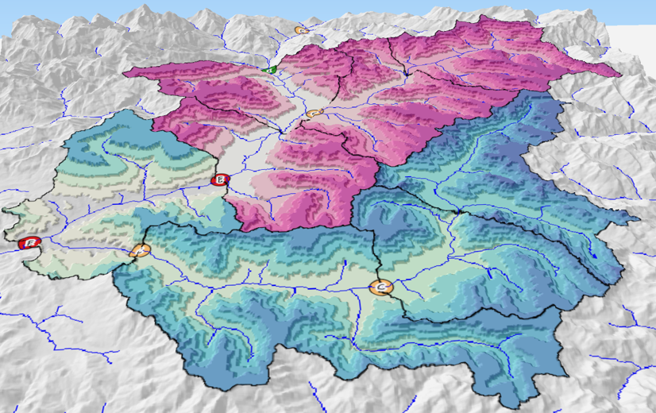

# Short Description
Python wrapper for the spatialized hydrological model [MORDOR-TS](https://doi.org/10.1016/j.jhydrol.2017.07.037) developed by EDF 

  

   <b>Hydrological spatialized mesh</b> 

# Installation
_pymordor_ is compatible with Python 2 and 3. It requires the environment variable LIBMORDOR to be set where the dynamic Fortran libraries are located. Fortran source files of MORDOR-TS are not provided but can be provided on [request](mailto:fabrice.zaoui@edf.fr).

# License
GPL v3

# Contributors
Please consider discussing the changes you wish to make via issue.
